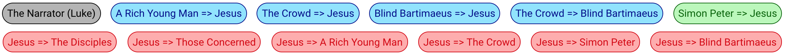

# Source =&gt; Recipient Buttons

Just like Google, we have created a whole new verb in the English language: "Sourcify" 

> _SOURCIFY: to format a body of text, assigning it with the appropriate SourceView data_.

When you work in the Bible Text Editor you are sourcifying the Biblical text.

These **Source =&gt; Recipient** buttons are the key to doing that properly:

These buttons are unique for each chapter. When you have a block of text that needs to be colored, you will find the Source =&gt; Recipient button and click it to appropriately format the text.

These are really important and it's vital to the accuracy of our project that you click the right button for the right text. It will require some keen observation on your part, but the action itself is quite effortless.

