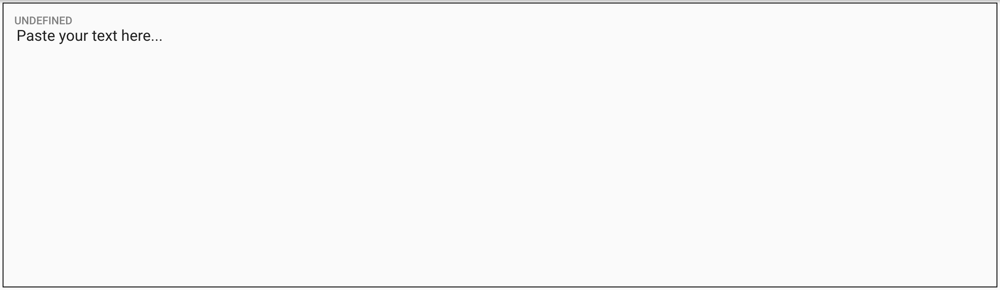
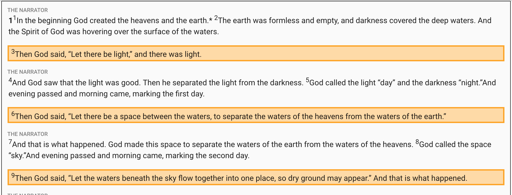

# Text Area

The text area is the part that needs the most attention. It's here that we are selecting what to format, how to format it and making sure that everything is accurate. When dealing with the Bible, we don't have room for errors. We honor the translators and the publishers of the version we format by making sure we aren't changing words or punctuation.

When first opening the Bible text editor the text area looks like this:

After selecting the book and chapter you will work on, the Bible text will appear and it will look something like this:

### SO WHAT ARE YOU LOOKING AT?

We have an automation program that pulls the text in and automates the sourcifying process for much of the Scriptures. Depending on the chapter you are working on, you might see many different colors of text. There are many things happening on the screen and here is a simple explanation for each of them:

1. **Black text:** this is the text for **"The Narrator"** or equivalent source. Other equivalent sources are:  **"The Choir"** in Song of Solomon **"The Preacher"** in Hebrews  **"The Compiler"** in Psalms
2. **Red text:** this is the text for **God**'s speaking parts
3. **Green text:** this is the speaking parts of **the main character\(s\)**
4. **Blue text:** these are the speaking parts of **everyone else** in a given book.
5. **Orange blocks:** These blocks are verses that include more than 1 color of text. It's your job as the formatter to find where speaking parts begin and end and make sure that they are colored  by clicking the appropriate [Source =&gt; Recipient button](source-greater-than-recipient-buttons.md).

