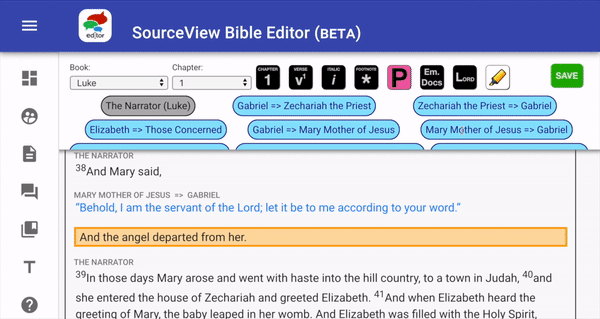
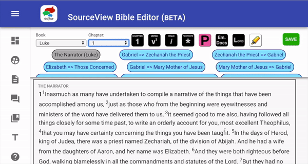

# Quirks of the Editor

Here are some things that will help you understand the functionality of the Editor itself. It's easy to assume that text editors function like Microsoft Word, Pages or WordPress. Our editor has its own ways of functioning that serve our purposes.

AUTOMATIC FORMATTING

When deleting a block separation, lower block will take on the properties of the upper block.

LINE BREAKS:

1. New block \(ENTER\)

1. Paragraph break \(SHIFT + ENTER\)

1. Poetry line breaks \(CTRL + ENTER\)
2. Paragraph indentation \(TAB\)

