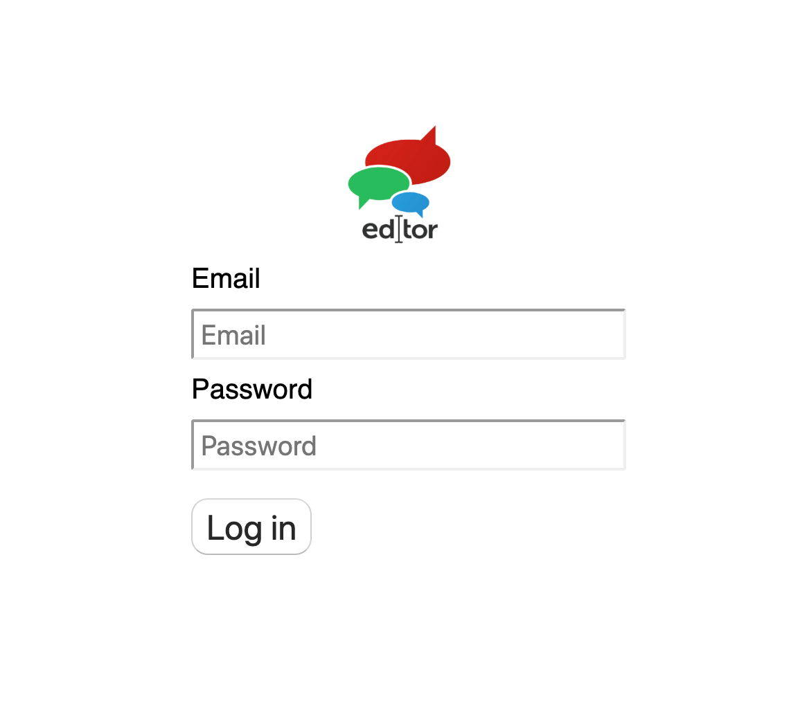

# Creating an user account

## Your Account Creation

The SourceView Bible Editor is a tool used by only a select group of people: those who are authorized to work on a specific version of the Bible. If you're reading this, you're most likely that person.Because of the closed nature of this work, account creation is not quite as straight forward as other online tools. We require \(and delight in\) human interaction. 

Accounts are created manually by one of our staff. You will need to contact our staff team in order to get an account. **Please email the following information to our team:**

* **Your name**
* **Email address \(this will be the email used to log in to the Editor\)**
* **Bible language that you will be working on**
* **Bible version \(name and copyright info would be the clearest for us\)**

**Please email that information to: rob.wiebe@uofn.edu**  
We will respond to your email as soon as we can. We thank you for your patience if there are any delays.

Once your account is created, you will receive an email from our staff with a password. You can then **log into the Editor** [**here**](https://sourceviewbible.github.io/new-svb-editor/). The login screen will look like this:

