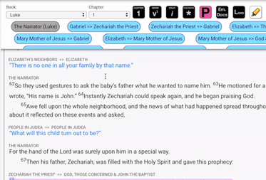

# Format Embedded Docs

Embedded docs are a unique feature of the SourceView Format. They visually display the appearance of a handwritten document. The purpose of this is to help the reader engage with the Scriptures in a fresh way, experiencing the handwritten feel of the original author.

Embedded docs are used to display written forms of communication. While the entire Bible is a written document, many of the words and content were not originally communicated in written form. For example, most of the historical narratives were transmitted orally, like the book of Genesis or the Gospels. However, the letters of Paul written to the churches across the Roman Empire were written communication in their original form. They are, therefore, embedded documents. There are other embedded documents within the Scriptures that we visually display.

There are SourceView defined embedded documents, which can be found in the [Instructions Per Chapter](../../instructions-per-chapter/instructions-per-chapter-1.md) segment of this Editor documentation.

### How to format an embedded document

1. Select the text
2. Click the "Embedded Docs" button

The text that you formatted should take on a different font style when it is correctly tagged. 


Note: Some language scripts may not change the font style. Please notify the SourceView team if this is the case for you: sourceviewteam@gmail.com


