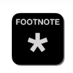
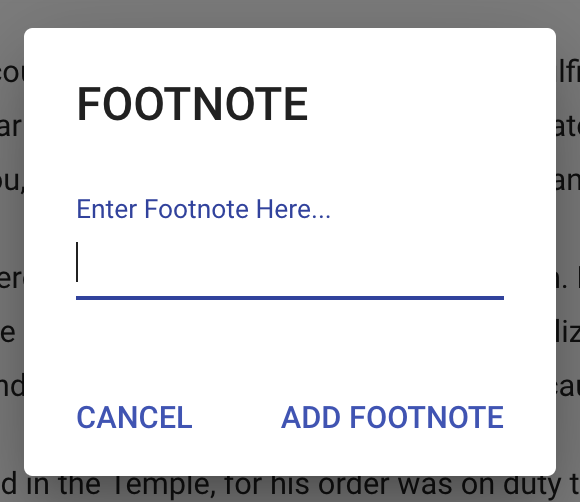
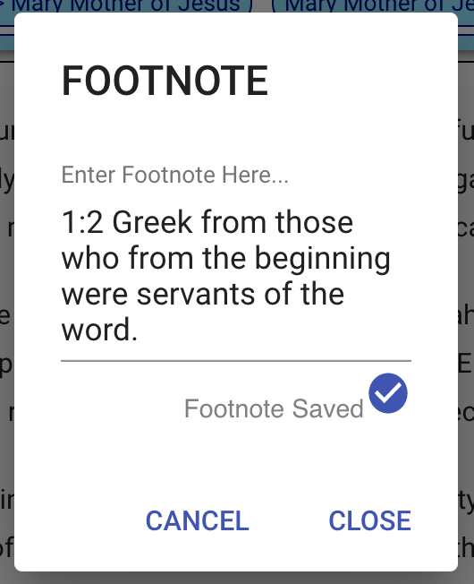

# Format Footnotes

Footnotes are very important when we work with translations of the Bible. We must honor the translators and publishers by keeping the footnotes that they have developed. In order to do that we have created the [footnote button](../bible-text-editor/toolbar.md#footnote-button) which will attach the footnotes to the text.

### Step \#1: Create Footnote Marker \(\*\)

Depending on your version, the Editor may or may not create the footnote mark for you. If it does not exist in the Editor, you will have to create one. Please use the \* mark for footnotes. We are using the same mark across all versions in the SourceView Bible.

### Step \#2: Highlight the Footnote Mark \(\*\)

It is important to highlight only the footnote mark and not any spaces before or after it. This becomes a button that users can touch on their mobile devices so that they can read the footnotes right along with the text.

### Step \#3: Click the Footnote Button

### Step \#4: Enter your footnote and click "Add Footnote"

Please make sure that the footnote text is _**EXACTLY**_ as it is in the text that you are grabbing it from. The footnotes were created by the translators and publishers and we must honor the content that they have provided.

### Step \#5: Click "Close" and verify the footnote has been saved correctly

### Step \#6: Verify footnote tagging

You can verify whether the footnote was saved or not by placing your mouse over the footnote marker in the biblical text. If a little tooltip popup appears with the footnote it was saved correctly.

There are some instances in which the "Save Footnote" button does not appear to be working. When you click on it the "Close" button may not appear. In that case, click "Cancel" to close the popup _\(we're still trying to figure out this tiny bug\)_. Placing your mouse over the footnote marker in the biblical text, you can verify whether it was saved or not.

### Repeat Steps \#1-6 for each footnote

