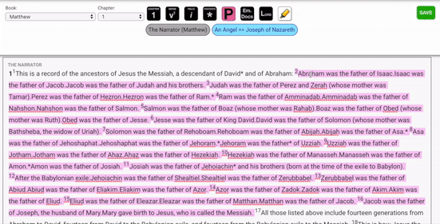
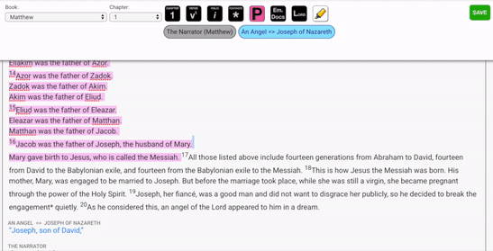

# Format Poetry

Poetry in the Bible has a unique format for SourceView. You may have already noticed that when you see poetry in the Reader. The way that this is accomplished is through the tagging of poetry text in the biblical text that you are formatting.

There are SourceView defined poetry highlights, which can be found in the [Instructions Per Chapter](../../instructions-per-chapter/instructions-per-chapter-1.md) segment of this Editor documentation.

### How to format poetry

1. Select the text
2. Click the "Poetry" button

Insert GIF

The text that you formatted should have a pink highlight around it.

### PLEASE DON'T...

1. Do not indent the poetry line breaks \(unless they are actual paragraphs\)
2. Do not put double line breaks between paragraphs

All of this formatting is done programmatically in the Reader and the App, so we do not need you to do that. In fact, if you do these things it will cause the Reader and App to have incorrect formatting. THANK YOU!

### Example:

### Special formatting when ending with a paragraph break

Many times there is a paragraph break after the end of a poetry section. When you create the paragraph the pink poetry formatting will also be applied to the paragraph break and indentation. It's important to remove that highlight by clicking the poetry button to toggle it off. See below as an example:

