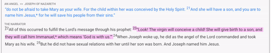
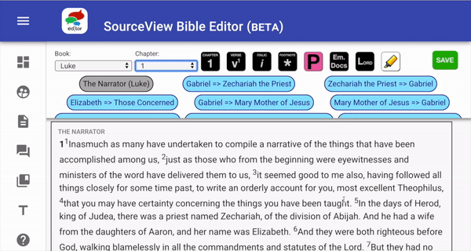

# Quirks of the Editor

Here are some things that will help you understand the functionality of the Editor itself. It's easy to assume that text editors function like Microsoft Word, Pages or WordPress. Our editor has its own ways of functioning that serve our purposes.

### AUTOMATIC FORMATTING

When deleting a block separation, lower block will take on the properties of the upper block.

### LINE BREAKS:

1. New Blocks
2. Paragraph breaks
3. Poetry line breaks
4. Paragraph indentations

Below are some gifs that demonstrate what each one looks like. The capitalized words in parenthesis are the keys that are used to make these formatting actions.

**New block \(ENTER\)**

**Paragraph break \(SHIFT + ENTER\)**  
You must press both SHIFT and ENTER at the same time.

**Poetry line breaks \(CTRL + ENTER\)**  
You must press both CTRL and ENTER at the same time.

**Paragraph indentation \(TAB\)**  
I'm pretty sure you know what this is, so we didn't make a gif. These would be used at the beginning of a new block \(not all new blocks, just the ones that have paragraphs in your version of the bible\).

### USING [TOOLBAR](../toolbar.md) BUTTONS

In order to apply the formatting of the buttons, text must be selected. Only selected text will receive the formatting.

### USING [SOURCE =&gt; RECIPIENT BUTTONS](../source-greater-than-recipient-buttons.md)

These buttons format the blocks of text. The cursor only needs to be in a block for the formatting to occur when you press one of these buttons. You don't need to select the entire block of text. This should help speed you up a little bit.

_NOTE: to change the block data, just put your cursor in that block and click the Source =&gt; Recipient button that you want to change it to. If the block is not orange, then it will turn orange on your first click. You can just click it again to format it appropriately._

