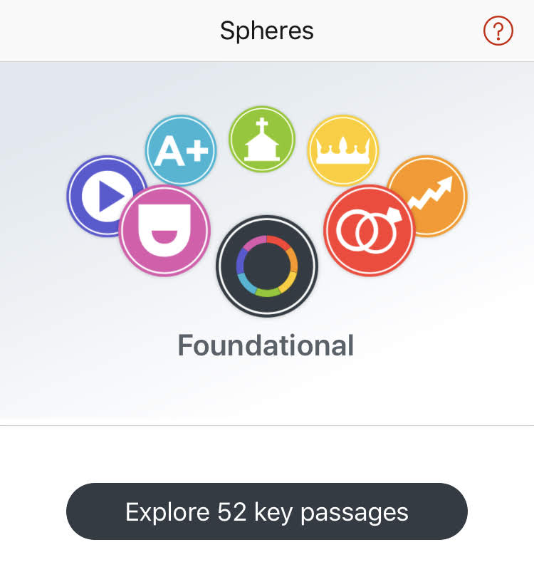
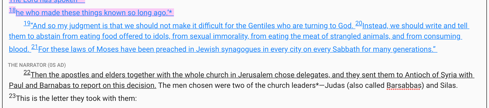
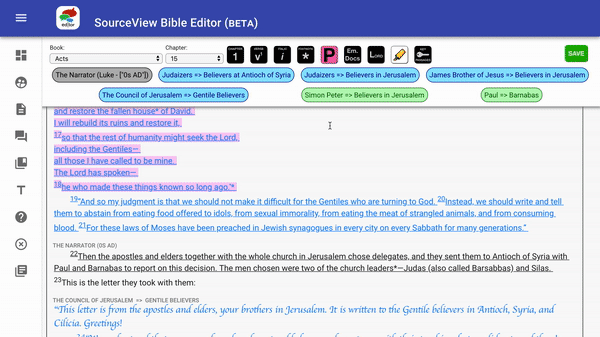

# SphereView Key Passages

[One of the SourceView Bible](http://sourceviewbible.com/#aspheres) data sets is called SphereView, which is a view of the Spheres of Influence in Society in the text, highlighted when a particular text relates to a sphere of influence. Out of all the highlights in Scripture, there are 52 key passages for each of the spheres of influence and another 52 key passages which would be considered foundational for all the spheres.

### A little bit of touch up work

These 416 passages are tagged in the Scriptures of the SourceView Editor. That tagging is automated, so there's not a lot of extra work for you.

There's still a little bit of work for you. Some of the key passages \(only 40 of them\) need to have their "highlights" trimmed. Those key passages either start or end in the middle of a verse. It's your responsibility to edit those highlights so that they accurately represent the key passage highlights.

### How to edit the Key Passages

The Key passages are the words that are underlined in the Editor. You may have noticed these underlines before and wondered what to do with them. They look like this:

It's very simple to edit these passages. Select the portion of Scripture that isn't supposed to be highlighted, click the "Key Passages" button, press "DELETE" and close the popup. That's it! Here's a visual example for you:

> NOTE: At the end of a Key Passage highlight we do not want to include the empty space. Please remove the space at the end if you can.

