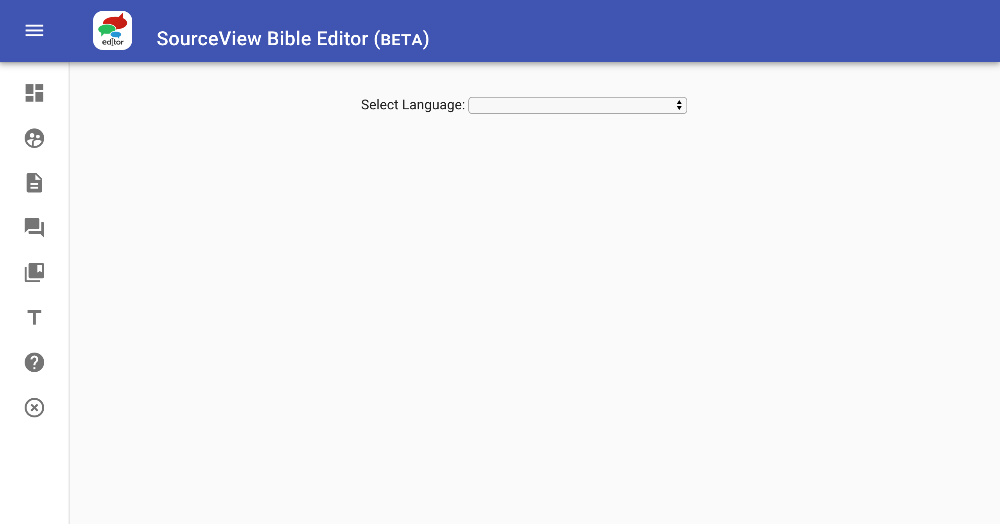

# The Editor layout and buttons

## Understanding the Editor layout and buttons

When you first log into the Editor you will see this opening dashboard:

After selecting your language you will see some different dashboard links appear:

These translation links are available with only a language selected because we translate _THIS_ content at the language level. There are two more elements of our work that deals with the uniqueness of each version of the Bible: introductions and Bible text formatting.  
Those other two elements appear when you select your version:

As you may have noticed, each of the cards on the dashboards has the logo that corresponds to the side menu. The side menu icons are also links to those parts of this application. By clicking the three white lines at the top left you can open the side menu to see the description of those icon links:

